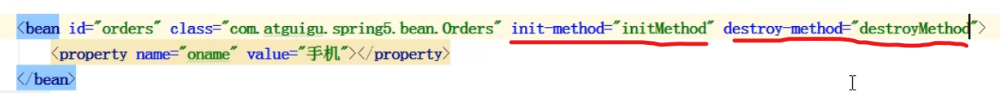

# Spring 5 学习笔记

本笔记基于尚硅谷 spring 5超详细源码级讲解 https://www.bilibili.com/video/BV1Vf4y127N5  Spring版本为 5.x

原教程视频时长 15小时， 学习周期【2022年7月6-10日】

# Spring 概念

1. Spring 是一个轻量级（体积小，jar包少。可以独立使用），开源的JavaEE框架。  
2. Spring 框架 解决企业应用开发的复杂性
3. Spring有两个核心部分：IOC、Aop

（1）IOC：控制反转，把创建对象的过程交给Spring管理

（2）Aop：面向切面，不修改源代码的前提下，进行功能的增强。

4. Spring 特点

（1）方便解耦，简化开发

（2）Aop 编程支持

（3）方便程序测试 （Junit）

（4）方便和其他框架整合（如Mybatis）

（5）方便进行事务、降低API的开发难度（对JDBC进行了封装）

（6）Spring源码是 经典学习范例！大师造！研读Spring源码可以快速提高能力。

# Spring 5 入门案例

1. IDEA中创建java项目

2. 访问：https://repo.spring.io/ui/native/release/org/springframework/spring/  下载 spring-5.2.9.RELEASE-dist.zip 并解压。

   > 
   >
   > Spring 发行包的组成部分（从底层向上看）
   >
   >1. Test 
   >2. Core Container （核心部分）
   > Beans 、 Core 对应 IOC的核心部分。
   > Context 上下文、 Expression  表达式
   >3. AOP ....
   >4. Data (JDBC、Transaction) / Web （Spring MVC）

   3. 导入Core Container 中的四个jar包到项目中。还有 commons-logging 这个日志包。因为spring的jar依赖了这个日志jar。\

   4. 创建普通类User，添加一个普通方法add。
      ```java
      public class User {
          public void add() {
              System.out.println("add.....");
          }
      }
      ```
      
   5. 创建Spring的配置文件， 并在配置文件中配置创建的对象。

      1. 配置文件使用XML格式创建。在src下创建xml配置文件。

      2. ```xml
         <!--    配置User对象创建-->
         <bean id="user" class="com.yiran.spring5.demo.User"></bean>
         ```

   6. 进行测试代码编写
```java
    @Test
    public void testAdd() {
//        1. 加载Spring配置文件
        ApplicationContext context = new ClassPathXmlApplicationContext("bean1.xml");
        	//可以换用另一个容器 BeanFactory，效果相同
        BeanFactory factory = new ClassPathXmlApplicationContext("bean1.xml");
//        2. 获取配置创建的对象
        User user = context.getBean("user", User.class);
        	factory.getBean("user", User.class);

        System.out.println(user);
        user.add();
    }
输出：
com.yiran.spring5.demo.User@670b40af
add.....
```

# IOC容器

## IOC底层原理

1. 什么是IOC

   控制反转（Inversion of Control），把对象创建和对象之间的调用交给Spring进行管理。

   使用IOC的目的：降低代码耦合。高内聚低耦合。

   入门案例即IOC的实现。

   2. IOC底层原理

      工厂模式、XML解析、反射 

      

      Spring IOC的过程

      

## IOC接口（BeanFactory）

IOC思想基于**IOC容器**完成，IOC容器的底层是**对象工厂**

Spring 提供了IOC容器的两种方式：（两个接口）

1. BeanFactory

   IOC容器的基本实现，Spring内部使用的接口。

   - 加载配置文件时，不会创建对象，在获取对象（使用）才会去创建对象。

2. ApplicationContext

  BeanFactory接口的子接口，提供了更多更强大的功能，面向开发人员进行使用的。

  - 一加载配置文件就会创建。 【服务器启动的时候就去创建，把耗时耗资源的操作放在服务器启动时。】


ClassPathXmlApplicationContext  ，src下，类路径。

FileSystemXmlApplicationContext ，对应带盘符的路径。

## IOC操作 Bean管理

1. 什么是Bean管理
   1. Spring创建对象
   2. Spring注入属性  set值 
2. Bean管理操作的实现方式：（1） 基于XML配置文件方式实现，（2）基于注解方式

### 1. 基于XML

#### 基于XML方式创建对象

```xml
<!--配置User对象创建
	id：唯一标识
	class：类全路径
-->
<bean id="user" class="com.yiran.spring5.demo.User"></bean>
```

（1）在Spring 配置文件中，使用bean标签，标签里面添加对应属性，就可以实现对象创建。

（3）创建对象时，默认执行无参构造方法。【若类没有无参构造，则创建对象失败，报错】

#### 基于XML方式注入属性

DI：依赖注入，注入属性。需要在创建对象的基础之上完成。

（1）使用set方法进行注入

```xml
<!--    用set 方法注入属性-->
<bean id="book" class="com.yiran.spring5.demo.Book"> <!--创建对象-->
    <!--使用property完成属性注入
        name:类里面属性的名称
        value:向属性中注入的值
    -->
    <property name="bname" value="深入理解JVM"></property>
    <property name="bauthor" value="ZH"></property>
</bean>
```

（2）使用有参构造注入

- 创建类，定义属性，创造属性对应的有参构造方法。

- 在Spring配置文件中进行配置

  ```xml
  <!--    使用有参构造注入属性-->
  <bean id="orders" class="com.yiran.spring5.demo.Orders">
      <constructor-arg name="oname" value="电脑"/>
      <constructor-arg name="address" value="China"/>
  </bean>
  ```

#### 基于XML注入其他类型属性

1. 字面量

   ```xml
   <!--向属性中设置空值-->
   <property name="bauthor">
       <null/>
   </property>
   ```

2. 注入属性 - 外部bean

   ```java
   public class UserService {
   
       //创建UserDao类型属性，生成Set方法
       private UserDao userDao;
   
       public void setUserDao(UserDao userDao) {
           this.userDao = userDao;
       }
   
       public void add(){
           System.out.println("Service.....add...");
           userDao.update();
       }
   }
   ```

   ```xml
   <!--    Service 和 Dao 对象的创建-->
   <bean id="userService" class="com.yiran.spring5.service.UserService">
       <!--     注入userDao对象
               ref:创建userDao对象bean标签id值。
           -->
       <property name="userDao" ref="userDao"/>
   </bean>
   <bean id="userDao" class="com.yiran.spring5.dao.UserDaoImpl"/>
   ```

3. 注入属性 - 内部bean

   （1）一对多关系：部门和员工

   一个部门有过个员工，一个员工属于一个部门。 部门是1，员工是多。

   （2）在实体类之间表示一对多关系

   ```java
   // 部门类
   public class Dept {
       private String dname;
   
       public void setDname(String dname) {
           this.dname = dname;
       }
   }
   
   // 员工类
   public class Emp {
       private String ename;
       private String gender;
   //    员工属于某一个部门
       private Dept dept;
   
       public void setEname(String ename) {
           this.ename = ename;
       }
       public void setGender(String gender) {
           this.gender = gender;
       }
   }	
   ```

```xml
    <!--    内部bean -->
    <bean id="emp" class="com.yiran.spring5.bean.Emp">
        <property name="ename" value="QQ"/>
        <property name="gender" value="nv"/>
<!--        设置对象类型属性-->
        <property name="dept">
            <bean id="dept" class="com.yiran.spring5.bean.Dept">
                <property name="dname" value="保安"/>
            </bean>
        </property>
     </bean>>
```

4. 注入属性 - 级联赋值

   ```xml
       <!--    内部bean -->
       <bean id="emp" class="com.yiran.spring5.bean.Emp">
           <property name="ename" value="QQ"/>
           <property name="gender" value="nv"/>
   <!--        设置对象类型属性-->
           <property name="dept" ref="dept"/>
        </bean>
       <bean id="dept" class="com.yiran.spring5.bean.Dept">
           <property name="dname" value="保安"/>
       </bean>
   ```

```xml
    <!--    内部bean -->
    <bean id="emp" class="com.yiran.spring5.bean.Emp">
        <property name="ename" value="QQ"/>
        <property name="gender" value="nv"/>
<!--        设置对象类型属性-->
        <property name="dept" ref="dept"/>
        <property name="dept.dname" value="财务"/>
     </bean>
    <bean id="dept" class="com.yiran.spring5.bean.Dept">
        <property name="dname" value="保安"/>
    </bean>
```

#### XML自动装配

根据指定的装配规则（属性名称/属性类型）Spring自动将匹配的属性值进行注入。

```xml
<!--    实现自动装配
    bean标签属性 autowire，配置自动装配
    autowire:
        byName:注入bean的id 和 类属性名称一样。
        byType：找跟类属性相同类型的bean，若有多个相同类型的bean则报错。
-->
    <bean id="emp" class="com.yiran.spring5.autowire.Emp" autowire="byName"/>
    <bean id="dept" class="com.yiran.spring5.autowire.Dept"/>
```

### 2. 基于注解

简化XML的配置，将XML以更优雅，更简洁的方式实现。

#### 创建对象

@Component

@Service

@Controller

@Repository

以上四个注解，功能相同，等价。都可以用于创建对象。

1. 引入依赖：spring-aop-5.xxx.RELEASE.jar

2. 在xml中开启组件扫描

   ```xml
   <content:component-scan base-package="com.yiran"/>
   ```

3. 创建类

   ```java
   //在注解里面，value属性值可以不写，
   //默认值是类名称，首字母小写 
   // UserService ---> userService
   @Component(value = "userService") // 等价于 <bean id="userService" class="..."/>
   public class UserService {
   	public void add(){
           ......
       }
   }
   ```

#### 属性注入

**@AutoWired：根据属性类型进行注入 （byType）**

```java
@Service
public class UserService {
    @Autowired
    private UserDao userDao;

    public void add(){
        System.out.println("Service.....add...");
        userDao.update();
    }
}
```

**@Qualifier：根据属性名称进行注入（byName）**

```java
@Service
public class UserService {

    @Autowired
    @Qualifier(value = "userDaoImpl")
    private UserDao userDao;

    public void add(){
        System.out.println("Service.....add...");
        userDao.update();
    }
}
```

@Resource：可以根据类型注入，也可以根据名称注入。

1. ```java
   @Service
   public class UserService {
       
   //    @Resource // 根据类型注入
       @Resource(name = "userDaoImol") //根据名称进行注入
       private UserDao userDao;
   
       public void add(){
           System.out.println("Service.....add...");
           userDao.update();
       }
   }
   ```

注意：@Resource 不是Spring的注解，而是javax  java扩展包中的注解，虽然功能一样，但是不建议使用!

> import org.**springframework**.stereotype.**Service**;
> import **javax**.annotation.**Resource**;


@Value：注入普通数据类型

1. ```java
   @Value(value = "abc")
   private String str;
   ```

### Spring 的纯注解开发

1. 创建配置类，替代xml配置文件。

   ```java
   @Configuration // 作为配置类，替代xml配置文件
   @ComponentScan(basePackages = {"com.yiran"})
   public class SpringConfig {
   }
   ```

```java
@Test
public void testAnnotation() {
    ApplicationContext context = new AnnotationConfigApplicationContext(SpringConfig.class);
    UserService userService = context.getBean("userService", UserService.class);
    System.out.println(userService);
}
```

现实中纯注解开发也不用上述Spring的方式，而是用SpringBoot（SpringBoot 本质上就是Spring，只不过对Spring进行了简化开发）

## FactoryBean

Spring 有两种类型的Bean，一种是普通bean，另外一种是工厂Bean（FactoryBean）

1. 普通bean：在Spring配置文件中，定义的bean类型就是返回类型。

2. FactoryBean：在Spring配置文件中，定义bean类型可以和返回类型不一致。

   （1）创建类，实现FactoryBean接口。

   （2）实现接口方法，在方法中定义返回值的类型。

   ```xml
   <!--    FactoryBean 的xml -->
   <bean id="myBean" class="com.yiran.spring5.factorybean.MyBean"/>
   ```

```java
public class MyBean implements FactoryBean {

    @Override
    public User getObject() throws Exception {
        User user = new User();
        user.add();
        return user;
    }

    @Override
    public Class<?> getObjectType() {
        return null;
    }

    @Override
    public boolean isSingleton() {
        return FactoryBean.super.isSingleton();
    }
}
```

```java
@Test
public void testFactoryBean(){
    ApplicationContext context = new ClassPathXmlApplicationContext("bean5.xml");
    User mybean = context.getBean("myBean", User.class);
    mybean.add();
}
```

## Bean的作用域

Spring默认情况下是单实例。singleton。  当scope设置为 prototype 时，为多实例。


1. 当scope 为 singleton时，加载Spring配置文件就会创建单实例对象。
2. scope为 prototype时，在调用getBean方法时，才会创建多实例对象。

## Bean的生命周期

（1）通过构造器创建bean实例（ 无参构造 ）

（2）为bean的属性设置值和对其他bean的引用 （调用set）

（3）把bean实例 传递给bean后置处理器 postProcessBeforeInitialization

（4）调用bean的初始化方法（需要进行配置初始化方法）

（5）把bean实例传递给bean后置处理器 postProcessAfterInitialization

（6）使用bean对象。（对象获取到了）	

（7）当容器关闭时，调用bean销毁的方法。（需要进行配置销毁方法）




# AOP

## 概念

AOP（Aspect Oriented Programming）面向切面编程。

可以对业务逻辑的各个部分进行隔离，**降低耦合度**，提高重用性，**提高开发效率**。

**不通过修改源代码，在主干功能中 添加新的功能。**

## 底层原理

1. AOP 底层使用动态代理

   （1）有接口：JDK动态代理

   - 创建接口实现类的代理对象，增强类的方法。

     

   （2）无接口：CGLIB动态代理

   - 创建子类的代理对象

     

## JDK 动态代理

1. 使用JDK动态代理，使用Proxy类里面的方法创建代理对象。
   - 调用newProxyInstance方法
     - 参数1：类加载器
     - 参数2：增强方法所在的类
     - 参数3:实现接口 InvocationHandler 创建代理对象。 

```java
public interface UserDao {
    public int add(int a, int b);
    public void update(String id);
}
```

```java
public class UserDaoImpl  implements  UserDao{
    @Override
    public int add(int a, int b) {
        System.out.println("add方法执行了");
        return a+b;
    }

    @Override
    public void update(String id) {
        System.out.println("Update...."+id);
    }
}
```

```java
// 创建代理对象
class UserDaoProxy implements InvocationHandler {
    // 创建的是谁的代理对象，就要把谁传递过来。
    // 有参构造
    private Object obj;

    public UserDaoProxy(Object obj) {
        this.obj = obj;
    }

    /**
     * invoke 方法的作用： 只要类被创建，方法就会被调用。
     * <p>
     * 在这里面写增强的逻辑。
     */

    @Override
    public Object invoke(Object proxy, Method method, Object[] args) throws Throwable {

        // 在方法之前
        System.out.println("Befor....." + method.getName() + ":传递的参数" + Arrays.toString(args));
        // 被增强的方法
        Object res = method.invoke(obj, args);
        // 在方法之后
        System.out.println("After.....  " + obj);

        return res;
    }
}
```

```java
public class JDKProxy {

    public static void main(String[] args) {
        // 创建接口实现类的代理对象
        Class[] interfaces = {UserDao.class};
//        Proxy.newProxyInstance(JDKProxy.class.getClassLoader(), interfaces, new InvocationHandler() {
//            @Override
//            public Object invoke(Object proxy, Method method, Object[] args) throws Throwable {
//                return null;
//            }
//        });
        UserDaoImpl userDao = new UserDaoImpl();
        UserDao dao =
            (UserDao) Proxy.newProxyInstance(JDKProxy.class.getClassLoader(), interfaces, new UserDaoProxy(userDao));
        int result = dao.add(1, 2);
        System.out.println("result: " + result);
    }
}
```

## AOP 术语

1. **连接点**

   可以被增强的方法，即连接点。

2. **切入点**

   实际被增强的方法，即切入点。

3. **通知（增强）**

   实际增强的逻辑即为通知（增强）

   - 前置通知：切入点之前执行通知。
   - 后置通知：切入点之后执行通知。
   - 环绕通知：前后都执行
   - 异常通知：切入点出现异常才执行
   - 最终通知：永远都会最后执行

4. **切面**

   是一个动作，把通知应用到切入点的过程。

## 准备

Spring框架中 基于AspectJ实现AOP操作。

1. 什么是AspectJ

   AspectJ不是Spring的组成部分，是个独立的AOP框架。但一般把AspectJ和Spring一起使用，来进行AOP的操作。

2. 基于AspectJ的AOP操作。

   XML配置文件实现

   注解方式实现

3. 在项目中引入AOP相关依赖。

4. 切入点表达式

   作用： 知道对哪个类的哪个方法进行增强。

   语法结构：  ``` execution（ [权限修饰符] [返回类型] [类全路径] [方法名称] ( [参数列表] ) ）``` 返回类型可以省略，用空格代替


 举例1：对com.yiran.dao.BookDao类里面的add()增强

`execution(* com.yiran.dao.BookDao.add(..))`

 举例2：对com.yiran.dao.BookDao类里面所有方法进行增强

`execution(* com.yiran.dao.BookDao.*(..))`

 举例3：对com.yiran.dao包里的所有类，类中的所有方法进行增强

`execution(* com.yiran.dao*.*(..))`


## AOP操作（AspectJ注解）

1. 创建类，定义方法

   ```java
   public class User {
       public void add(){
           System.out.println("add.....");
       }
   }
   ```

2. 创建增强类，写增强逻辑。

   ```java
   public class UserProxy {
       // 前置通知。
       public void before(){
           System.out.println("before...");
       }
   }
   ```

3. 进行通知的配置

   (1) 在Spring配置文件中，开启注解扫描 

   ```xml
   <?xml version="1.0" encoding="UTF-8"?>
   <beans xmlns="http://www.springframework.org/schema/beans"
          xmlns:xsi="http://www.w3.org/2001/XMLSchema-instance"
          xmlns:context="http://www.springframework.org/schema/context"
          xmlns:aop="http://www.springframework.org/schema/aop"
          xsi:schemaLocation="http://www.springframework.org/schema/beans http://www.springframework.org/schema/beans/spring-beans.xsd
                               http://www.springframework.org/schema/context http://www.springframework.org/schema/context/spring-context.xsd
                               http://www.springframework.org/schema/aop http://www.springframework.org/schema/aop/spring-aop.xsd">
   
   <!--    开启注解扫描-->
       <context:component-scan base-package="com.yiran.spring5.aop"/>
   
   </beans>
   ```

   (2) 使用注解创建User和UserProxy对象

   ```java
   /**
    * 被增强类
    */
   @Component
   public class User {
       public void add(){
           System.out.println("add.....");
       }
   }
   ```

   ```java
   /**
    * 增强类
    */
   @Component
   public class UserProxy {
       // 前置通知。
       public void before(){
           System.out.println("before...");
       }
   }
   ```

   (3) 在增强类上面添加注解@Aspect

   ```java
   @Component
   @Aspect //生成代理对象
   public class UserProxy {
       // 前置通知。
       public void before(){
           System.out.println("before...");
       }
   }
   ```

   (4) 在spring配置文件中开启生成代理对象  

   ```xml
   <!--    开启AspectJ生成代理对象-->
       <aop:aspectj-autoproxy/>
   ```

4. 配置不同类型的通知

   在增强类中，通知方法上添加通知类型注解，使用切入点表达式配置

   ```java
   @Component
   @Aspect //生成代理对象
   public class UserProxy {
      // 前置通知。
       @Before(value = "execution(* com.yiran.spring5.aop.anno.User.add(..))")
       public void before() {
           System.out.println("before...");
       }
   
       //最终通知 不管有没有异常 都执行
       @After(value = "execution(* com.yiran.spring5.aop.anno.User.add(..))")
       public void after() {
           System.out.println("after....");
       }
   
       //后置通知（返回通知)，当有异常就不执行。
       @AfterReturning(value = "execution(* com.yiran.spring5.aop.anno.User.add(..))")
       public void afterReturning() {
           System.out.println("afterReturning....");
       }
   
       //异常通知
       @AfterThrowing(value = "execution(* com.yiran.spring5.aop.anno.User.add(..))")
       public void afterThrowing() {
           System.out.println("afterThrowing....");
       }
   
       //环绕通知：在方法之前和之后都执行。
       @Around(value = "execution(* com.yiran.spring5.aop.anno.User.add(..))")
       public void around(ProceedingJoinPoint proceedingJoinPoint) throws Throwable {
           System.out.println("环绕之前....");
           proceedingJoinPoint.proceed();
           System.out.println("环绕之后....");
       }
   }
   ```

5. 相同的切入点进行抽取

   ```java
   //相同切入点进行抽取
   @Pointcut(value = "execution(* com.yiran.spring5.aop.anno.User.add(..))")
   public void pointCut(){
   
   }
   
   // 前置通知。
   @Before(value = "pointCut()")
   public void before() {
       System.out.println("before...");
   }
   ```

6. 有多个增强类，设置增强类的优先级

   在增强类上面添加注解：@Order(数字类型值)，这个数字越小，优先级越高。

# JDBCTemplate

# 事务管理

# Spring 5 新特性

